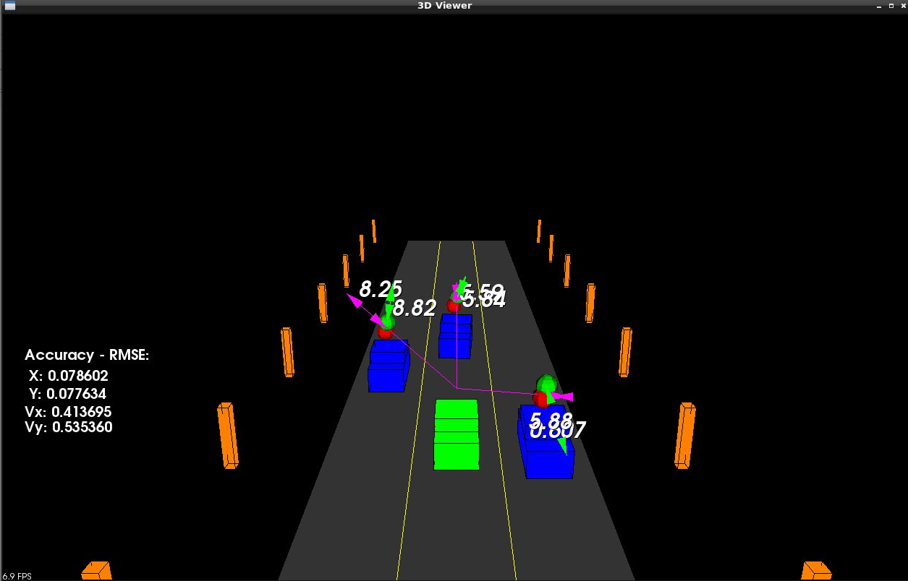

# SFND_Unscented_Kalman_Filter
Implemented the logic as per the lessons. However, felt the need to tidy up the code structure:
Firstly, added variables `Xsig_aug_`  and `X_deltas_ = Xsig_pred_.colwise() - x_` to the UKF class 
for better reuse. 

More imporantly, encapsulated the sensor-specific details into children of `SensorDetails` abstract class (see the 
very top of `ukf.cpp`), 
containing `n_z`, `R` (and therefore all the sensor std values), and the function mapping a single vector containing state onto the corresponding 
sensor measurement vector. These are then passed to the `ProcessSensor` function along with the actual
measurement value and a boolean `error_mod_2pi`, which if true, tells us to take the yaw component of the estimation 
error modulo pi (as the atan function only returns values from -pi/2 to pi/2). 

The only other change I made to the flow suggested in the lesson was dropping the 'initialize on first call' logic. It's 
completely unnecessary if we set the initial P matrix to sufficiently large diagonal values ('diffuse prior'), though 
in the UKF case these have to still be small enough that we can generate meaningful sigma points from them.

All in all, seems to work quite well, giving errors even smaller than in the video in the original README.md.

